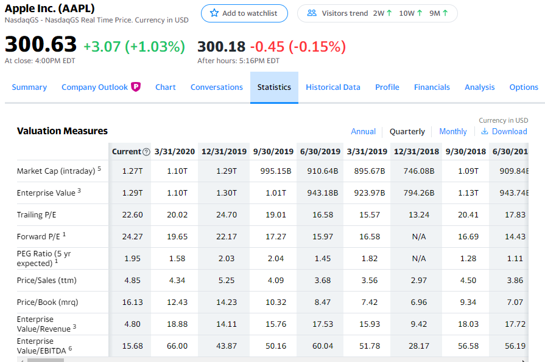

Change Log
==========

2.2.15
------
- Updated the data available from the cash flow statement

2.2.14
------
- Updated the financials dataframes (cash_flow, income_statement, balance_sheet, all_financial_data,
  get_financial_data) to include another column titled "currencyCode".  This will identify the currency
  used in the financial statement.

2.2.13
------
- Fix bug related to dividends and stock splits.  The merge statement to combine the pandas dataframes
  was using a left join instead of an outer join, which caused stock splits to drop.

2.2.11
------
- Fix bug with async requests and :code:`symbols` as a query parameter

2.2.9
-----
- Fix internal method :code:`_format_data` in the :code:`_YahooFinance` class to account for dates held in lists
- Use flit to publish package to pypi.  Additionally, make selenium an optional package to install through :code:`pip install yahooquery[premium]`

2.2.8
-----
- :code:`Ticker`, :code:`Screener`, and :code:`Research` classes now accept the
  keyword argument :code:`progress`.  If set to :code:`True`, a progress bar will
  be displayed when downloading data.  The default value is :code:`False`
- Add a :code:`search` function.  This allows you to query Yahoo Finance for anything.
  Search for a company via cusip, ISIN Number, name, etc.  The function returns a dictionary
  containing most relevant quotes and news items.  You can also provide an argument :code:`first_quote`
  that returns only the most relevant quote from the query
- Add a :code:`currency_converter` function.  This will retrieve the current conversion rate between
  two specified currencies as well as historical rates over a specified period.
- Fix bug related to converting financials (income statement, balance sheet, cash flow) to dataframe.
- The :code:`symbols` argument to the :code:`Ticker` class now accepts any iterable.  The strings
  will also be converted to uppercase.

2.2.7
-----
- Fix bug related to ticker symbols with "&"
- Add functionality to retrieve most recent 30 days of one minute interval data
- Add Taiwan to the COUNTRIES dictionary

2.2.6
-----
- Allow premium subscribers to set environment variables for their Yahoo login credentials,
  specifically YF_USERNAME and YF_PASSWORD
- Fix bug when validating symbols.  If too many symbols are passed, the URL that's constructed
  becomes too long and a 414 error occurs
- Fix bug related to login via Selenium
- Enable country argument in miscellaneous functions
- Add argument to history method that allows user to adjust OHLC data based on adjusted close

2.2.5
-----
- Add more data accessors for the :code:`Ticker` class:  :code:`quotes`,
  :code:`corporate_events`, :code:`all_financial_data`, :code:`get_financial_data`,
  :code:`corporate_guidance`, :code:`p_all_financial_data`, and :code:`p_get_financial_data`
- Financials methods now include optional argument to include / exclude the trailing
  tweleve month (TTM) data.
- The :code:`history` method on the :code:`Ticker` class now accepts an optional argument
  to adjust the timezone (:code:`adj_timezone`) to the ticker's timezone. It defaults
  to :code:`True`.
- Further documentation of acceptable keyword arguments to the :code:`Ticker` class.
- :code:`Ticker.news` is now a method.  It accepts two arguments:  :code:`count` - 
  number of items to return; :code:`start` - start date to begin retrieving news items from
- Bug fixes:  :code:`Ticker.history` method no longer returns extra rows when retrieving
  intraday data.

2.2.4
-----
- Increase the number of items available through the :code:`income_statement`,
  :code:`cash_flow`, :code:`p_income_statement`, and :code:`p_cash_flow` methods
  on the :code:`Ticker` class.
- Update how the session is initialized; specifically, include a timeout in the
  requests that are made, include a hook for bad status codes, and mount the
  adapter / retry to https requests

2.2.3
-----
- Add :code:`valuation_measures` as a property to the :code:`Ticker` class.
  Additionally, for Yahoo Finance premium subscribers, they can access the
  :code:`p_valuation_measures` and supply either :code:`a`, :code:`q`, or
  :code:`m` (annual, quarterly, monthly).  The data returned with these can
  be seen in the `Statistics` tab through the Yahoo Finance front-end.
  

2.2.2
-----
- Fix bug in retrieving cash flow / income statement data.  Most recent month was 
  combining with TTM. A new column was created in the dataframe called 'periodType'.
  Annual data will be shown as '12M', quarterly data will be shown as '3M', and
  trailing 12 month data will be shown as 'TTM'.

2.2.1
-----
- Fix timestamp conversion in the _format_data method of the _YahooFinance class

2.2.0
-----
- New Research class that allows a user with a premium subscription to retrieve
  research reports and trade ideas from Yahoo Finance.  List of trade ideas
  through Yahoo Finance can be seen at: https://finance.yahoo.com/research/trade-ideas.
  Research reports can be seen at https://finance.yahoo.com/research.

2.1.0
-----
- New Screener class that allows a user to retrieve predefined Yahoo
  Finance lists.  Some of these lists include most active, day gainers,
  day losers, cryptocurrencies, and sectors / industries

2.0.0
-----
- Have Ticker class inherit from a base class, defined in base.py as
  _YahooFinance.  The base class contains the order of operations to
  retrieve data (construct parameters, construct URLs, validate response,
  and format the data).
- Yahoo login functionality, which allows a user to retrieve Premium data if they are a subscriber

  - All available financials data (income_statement, balance_sheet, cash_flow)
  - Company 360 (innovation score, significant developments, supply chain,
    hiring statistics, and company outlook)
  - Premium portal (research reports, trade ideas, technical events, value analyzer,
    and company snapshots)
  - Technical events
  - Value analyzer (High-level value analysis)
  - Value analyzer Drilldown (Detailed information about a symbol(s) value)
  - Research reports
  - Trade ideas

- New (free) data!

  - news
  - page_views
  - recommendations
  - technical_insights
  - validation

- Change several properties and methods (get_endpoints -> get_modules,
  all_endpoints -> all_modules)

1.1.3
-----
- Fix bug related to symbols that have characters that need to be url
  encoded (^)

1.1.2
-----
- Allow for user to use a string as a list of symbols to pass to Ticker class.
  For example, previous version would require user to pass
  `['fb', 'msft', 'goog']` to retrieve those three symbols.  Now, the user
  can pass `'fb msft goog'` or `'fb,msft,goog'`.
- Allow user to pass string, as well as list, to `get_endpoints` method.  For
  example, `['assetProfile', 'balanceSheetHistory']` is equivalent to
  `'assetProfile balanceSheetHistory'`.

1.1.1
-----
- Fill NA values from history dataframe.  Event data (dividends and splits)
  will be filled with zeros.  Other columns (high, low, open, close,
  volume, adjclose) will be filled with prior day's data.
- Fill NA values from options dataframe.  Missing values are replaced with zero

1.1.0
-----
- Entire library makes asynchronous requests (missing piece was the
  option_chain method).

1.0.15
------
- Missing required library requests-futures in setup.py file

1.0.14
------
- Add asynchronous requests with the requests-futures library
- Add "events" to the history dataframe (dividends and splits)

1.0.13
------
- Add `adjclose` column to dataframe returned from `yahooquery.Ticker.history`

1.0.12
------
- Changed private Ticker variables (_ENDPOINTS, _PERIODS, and _INTERVALS)
  to public
- Updated README for new multiple endpoint methods as well as a comparison
  to yfinance
- Forced dictionary return when formatted = False.

1.0.11
------
- Bug fix related to accessing the multiple endpoint methods
  (get_endpoints, all_endpoints).  Error would occur during
  formatting, specifically for the earningsTrend endpoint
- Bug fix related to passing one endpoint to the get_endpoints
  method.

1.0.10
------
- Added docstrings to each property / method
- Changed get_multiple_endpoints method to get_endpoints
- Added all known endpoints into Ticker class.  Missing
  endpoints were earnings, earnings_trend, and index_trend

1.0.9
-----
- Removed combine_dataframes kwarg.  This is just the default behavior now.
- Removed ticker column in history method.  `symbol` is now part of
  a MultiIndex in the returned DataFrame

1.0.8
-----
- Updated option_chain method for bugs as well as MultiIndex indexing
  to allow the user an easier way to make cross-sections of the
  resulting data.

1.0.7
-----
- Made the symbols argument to the `Ticker` class a required argument
- Fixed bug related to the `fund_category_holdings` property.
- Fixed bug related to the `history` method.
- Added tests and initial attempt at Travis CI

1.0.6
-----
- Added frequency arguments to `balance_sheet`, `cash_flow`, and
  `income_statement` methods.  They will default to annual, but can
  return quarterly statements with "q" or "Q" arguments.
- Added a `calendar_events` property to the `Ticker` class.
  Shows next earnings date, previous dividend date, and other metrics.

1.0.5
-----
- Fixed bug related to formatting empty lists

1.0.4
-------
- Add `fund_performance` property to the `Ticker` class.  Shows
  historical fund performance as well as category performance.
