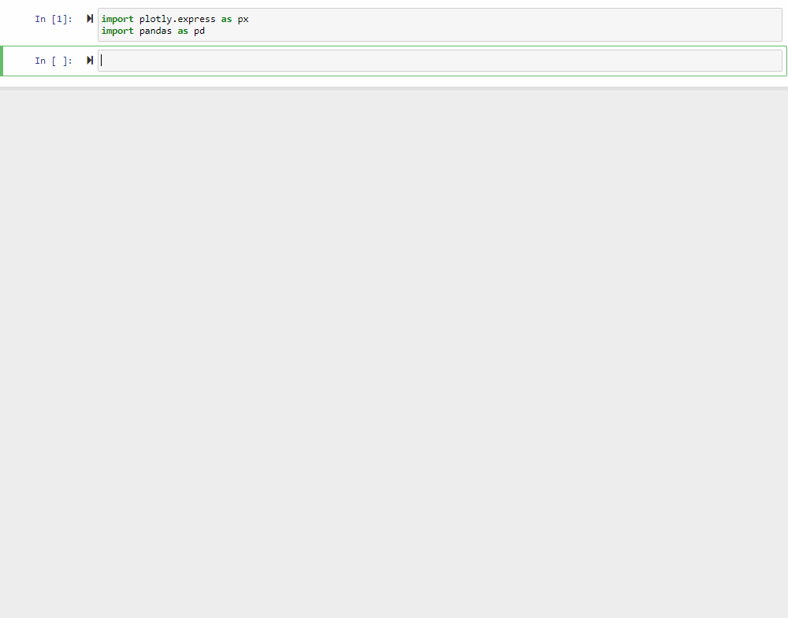

# Yahooquery
[](https://www.codefactor.io/repository/github/dpguthrie/yahooquery/overview/master)
[](https://crate.io/packages/yahooquery/)
[](https://pypi.python.org/pypi/yahooquery/)
[](https://pypi.python.org/pypi/yahooquery/)
[](https://pypi.python.org/pypi/yahooquery/)
[](https://travis-ci.com/dpguthrie/yahooquery)
[](https://codecov.io/gh/dpguthrie/yahooquery)

Python wrapper around an unofficial Yahoo Finance API.  Check out an interactive demo at (https://yahooquery-streamlit.herokuapp.com)



## Install

```bash
pip install yahooquery
```

## Ticker

The `Ticker` module is the access point to the Yahoo Finance API.  Pass a ticker symbol to the `Ticker` class.

```python
from yahooquery import Ticker

aapl = Ticker('aapl')
```

Or pass a list of tickers.

```python
tickers = Ticker(['aapl', 'msft'])
```

## Data

Based on the data you'd like, the result will either be accessed through a `dict` or as a `pandas.DataFrame`.  Accessing data is incredibly easy and pythonic.

### Dictionaries

```python
aapl = Ticker('aapl')

# Asset Profile
aapl.asset_profile
{'aapl': {'address1': 'One Apple Park Way', 'city': 'Cupertino', ... }}

# ESG Scores
aapl.esg_scores
{'aapl': {'totalEsg': 72.27, 'environomentScore': 89.81, ... }}

# Financial Data
aapl.financial_data
{'aapl': {'currentPrice': 275.15, 'targetHighPrice': 342.4, ... }}

# Key Statistics
aapl.key_stats
{'aapl': {'priceHint': 2, 'enterpriseValue': 1230054359040, ... }}

# Price Information
aapl.price
{'aapl': {'preMarketChange': {}, 'preMarketPrice': {}, ... }}

# Quote Type
aapl.quote_type
{'aapl': {'exchange': 'NMS', 'quoteType': 'EQUITY', ... }}

# Share Purchase Activity
aapl.share_purchase_activity
{'aapl': {'period': '6m', 'buyInfoCount': 20, ... }}

# Summary Information
aapl.summary_detail
{'aapl': {'priceHint': 2, 'previousClose': 271.46, ... }}
aapl.summary_profile
{'aapl': {'address1': 'One Apple Park Way', 'city': 'Cupertino', ... }}
```

How about more than one ticker?

```python
# Pass a list of tickers to the Ticker class
tickers = Ticker(['aapl', 'msft'])

tickers.asset_profile
{'aapl': {'address1': 'One Apple Park Way', 'city': 'Cupertino', ... }, 'msft': {'address1': 'One Microsoft Way', 'city': 'Redmond', ... }}

tickers.esg_scores
{'aapl': {'totalEsg': 72.27, 'environomentScore': 89.81, ... }, 'msft': {'totalEsg': 74.8, 'environmentScore': 84.17, ... }}

tickers.financial_data
{'aapl': {'currentPrice': 275.15, 'targetHighPrice': 342.4, ... }, 'msft': {'currentPrice': 154.53, 'targetHighPrice': 174.0, ... }}

tickers.key_stats
{'aapl': {'priceHint': 2, 'enterpriseValue': 1230054359040, ... }, 'msft': {'priceHint': 2, 'enterpriseValue': 1127840350208, ... }}

tickers.price
{'aapl': {'preMarketChange': {}, 'preMarketPrice': {}, ... }, 'msft': {'preMarketChange': {}, 'preMarketPrice': {}, ... }}

tickers.quote_type
{'aapl': {'exchange': 'NMS', 'quoteType': 'EQUITY', ... }, 'msft': {'exchange': 'NMS', 'quoteType': 'EQUITY', ... }}

tickers.share_purchase_activity
{'aapl': {'period': '6m', 'buyInfoCount': 20, ... }, 'msft': {'period': '6m', 'buyInfoCount': 30, ... }}

tickers.summary_detail
{'aapl': {'priceHint': 2, 'previousClose': 271.46, ... }, 'msft': {'priceHint': 2, 'previousClose': 153.24, ... }}

tickers.summary_profile
{'aapl': {'address1': 'One Apple Park Way', 'city': 'Cupertino', ... }, 'msft': {'address1': 'One Microsoft Way', 'city': 'Redmond', ... }}

```

### Dataframes

```python
aapl.company_officers
aapl.earning_history
aapl.grading_history
aapl.insider_holders
aapl.insider_transactions
aapl.institution_ownership
aapl.recommendation_trend
aapl.sec_filings
aapl.fund_ownership
aapl.major_holders
aapl.earnings_trend

# The following methods take a frequency argument.  If nothing is provided, annual data will be returned.  To return quarterly data, pass "q" as an argument.
aapl.balance_sheet()  # Defaults to Annual
aapl.balance_sheet(frequency="q")
aapl.balance_sheet("q")
aapl.cash_flow()
aapl.income_statement()
```

## Fund Specific

Mutual Funds have many of the accessors detailed above as well as the additional ones below:

```python
fund = Ticker('rpbax')

fund.fund_category_holdings  # pandas.DataFrame
fund.fund_bond_ratings  # pandas.DataFrame
fund.fund_sector_weightings  # pandas.DataFrame
fund.fund_performance  # dict
fund.fund_bond_holdings  # dict
fund.fund_equity_holdings  # dict
```

## Options

Retrieve option pricing for every expiration date for given ticker(s)

```python
import pandas as pd
df = aapl.option_chain  # returns pandas.DataFrame

# The dataframe contains a MultiIndex
df.index.names
FrozenList(['symbol', 'expiration_date', 'option_type', 'row'])

# Get all options for specified symbol
df.loc['aapl']

# Get specific expiration date for specified symbol
df.loc['aapl', '2020-01-02']

# Get specific option type for expiration date for specified symbol
df.loc['aapl', '2020-01-02', 'calls']

# Works with multiple tickers as well
tickers = Ticker(['aapl', 'msft', 'fb'])
df = tickers.option_chain

# Retrieve options for only one symbol
df.loc['aapl']

# Retrieve only calls for all symbols
df.xs('calls', level=2)

# Retrieve only puts for fb
df.xs(('fb', 'puts'), level=[0, 2])
# or
df.xs(('fb', 'puts'), level=['symbol', 'option_type'])

# Filter dataframe by options that in the money
df.loc[df['inTheMoney'] == True]

# Only include Apple in the money options
df.loc[df['inTheMoney'] == True].xs('aapl') 
```

## Historical Pricing

Historical price data can be retrieved for one or more tickers through the `history` method.

```python
aapl.history()
```

If no arguments are provided, as above, default values will be supplied for both `period` and `interval`, which are `ytd` and `1d`, respectively.  Additional arguments you can provide to the method are `start` and `end`.  Start and end dates can be either strings with a date format of `yyyy-mm-dd` or as a `datetime.datetime` object.

```python

aapl.history(period='max')
aapl.history(start='2019-05-01')  # Default end date is now
aapl.history(end='2018-12-31')  # Default start date is 1900-01-01

# Period options = 1d, 5d, 1mo, 3mo, 6mo, 1y, 2y, 5y, 10y, ytd, max
# Interval options = 1m, 2m, 5m, 15m, 30m, 60m, 90m, 1h, 1d, 5d, 1wk, 1mo, 3mo
```

Available periods and intervals can be seen through `Ticker.PERIODS` and `Ticker.INTERVALS`, respectively.

If trying to retrieve more than one ticker, one dataframe will be returned and the column `ticker` can be used to identify each row appropriately.

```python
tickers = Ticker(['aapl', 'msft'])
tickers.history()
```
| symbol | dates               |   volume |    open |    low |   high |   close |
|:-------|:--------------------|---------:|--------:|-------:|-------:|--------:|
| AAPL   | 2019-01-02 07:30:00 | 37039700 | 154.89  | 154.23 | 158.85 |  157.92 |
| AAPL   | 2019-01-03 07:30:00 | 91312200 | 143.98  | 142    | 145.72 |  142.19 |
| MSFT   | 2019-12-12 07:30:00 | 24612100 | 151.65  | 151.02 | 153.44 |  153.24 |
| MSFT   | 2019-12-13 14:00:01 | 23850062 | 153.003 | 152.85 | 154.89 |  154.53 |

## Multiple Endpoints

Multiple endpoints can be accessed in one call for a given symbol through two separate endpoints:  `get_endpoints` and `all_endpoints`.  The `get_endpoints` method
takes in a `list` of allowable endpoints.  Conversely, the `all_endpoints` property will retrieve all base endpoints.

```python
aapl = Ticker('aapl')
endpoints = ['assetProfile', 'esgScores', 'incomeStatementHistory']
data = aapl.get_endpoints(endpoints)

# or

data = aapl.all_endpoints

# The symbol(s) and endpoints become the keys in the dictionary

data['aapl']['assetProfile']
data['aapl']['esgScores']
data['aapl']['incomeStatementHistory']
```

### Notes

- The data will always be returned as a dictionary
- `Ticker.ENDPOINTS` will show you the list of allowable endpoints you can pass to the `get_endpoints` method

## Caution

This package uses asynchronous requests through the requests-futures package.  If you're downloading a lot of data, be mindful of the impact you're having on Yahoo's servers.  The default number of workers is set at 8 but can be changed through the `max_workers` argument when initializing a `Ticker`.
